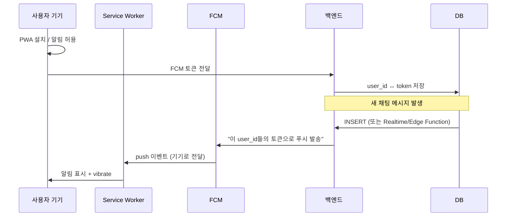

# 강사 채팅 개선 — 실행 전 최종 정리

8번(카카오 알림 보조) 제외, 6번(PWA + FCM) 상세 설명 포함. 실행 시 이 문서 기준으로 진행하면 됩니다.

---

## 적용할 작업 범위 (8번 제외)

| 번호 | 항목 | 구분 |
|------|------|------|
| 1 | 선생님 방 목록: `last_message_at` 사용·N+1 제거·최신 채팅 순 | 즉시 |
| 2 | 선생님 읽음 처리 + 未读 배지 + `formatChatTimestamp` | 즉시 |
| 3 | 선생님 메시지 페이징(50건 단위, 위로 스크롤 추가 로드) | 즉시 |
| 4 | 선생님 리스트 화면 Realtime(전역 INSERT 구독) | 즉시 |
| 5 | 선생님 Web 알림(Notification + 선택적 vibrate) | 즉시 |
| 6 | PWA + FCM(앱 꺼져 있어도 핸드폰 푸시/진동) | 중기 |
| 7 | 채팅 로직 공통화(admin/teacher 동일 규칙) | 중기 |
| ~~8~~ | ~~카카오 알림 보조~~ | **제외** |
| 9 | 오프라인/재전송(실패 시 큐·재시도, Realtime 재연결) | 장기 |

---

## 1~5번: 즉시 적용 (상세)

### 1. 선생님 방 목록 — 최신 채팅 순 + N+1 제거

- **현재**: `chat_participants` → `chat_rooms` → 방마다 `chat_participants` + `chat_messages` 1건씩 조회 후 클라이언트 정렬.
- **변경**:  
  - 내 `room_id` 목록 조회(`chat_participants`)  
  - `chat_rooms`를 해당 ID로 `in('id', roomIds)` + `order('last_message_at', { ascending: false, nullsFirst: false })` + `select('*')`  
  - 참여자 수는 기존 denormalize 데이터 또는 별도 1회 집계로 처리  
- **파일**: `app/teacher/chat/page.tsx` — `fetchMyRooms` 전면 수정.

### 2. 선생님 읽음 처리 + 未读 배지 + 날짜 포맷

- **읽음**: 방 입장 시 `chat_participants`의 `last_read_at` 업데이트(admin과 동일 `markAsRead` 패턴).
- **未读**: `get_unread_counts` RPC 호출해 방별 unread 수 저장, 리스트에 배지 표시.
- **날짜**: 방 리스트·메시지 내 시간/날짜 구분선에 `formatChatTimestamp` 사용(admin과 동일 규칙).
- **파일**: `app/teacher/chat/page.tsx`, `app/lib/utils.ts`(이미 있으면 참조만).

### 3. 선생님 메시지 페이징

- 방 입장 시 최근 50건만 로드. 위로 스크롤 시 이전 50건 추가 로드.
- **파일**: `app/teacher/chat/page.tsx` — `enterRoom`·`loadMessages`·`loadMoreMessages`·스크롤 ref 추가(admin 채팅 참고).

### 4. 선생님 리스트 화면 Realtime

- `view === 'list'`일 때도 `postgres_changes`(chat_messages INSERT) 구독.
- 새 메시지 시 `fetchMyRooms(myId)` 호출로 방 목록·미리보기·순서 갱신.
- **파일**: `app/teacher/chat/page.tsx` — list 뷰용 useEffect + channel 구독/해제.

### 5. 선생님 Web 알림

- 페이지 로드 시 `Notification.requestPermission()` 요청(아직 안 했다면).
- 전역(또는 내 참여 방만) INSERT 구독 시, 발신자가 자신이 아니면 `new Notification(...)` 호출.
- (선택) `vibrate: [200, 100, 200]` 등 옵션 추가.
- **파일**: `app/teacher/chat/page.tsx`.

---

## 6번: PWA + FCM — 상세 설명

### 목적

- **앱이 꺼져 있거나 백그라운드일 때**에도 새 채팅 메시지가 오면 **핸드폰 자체 알림(잠금화면·배너·진동)**으로 받을 수 있게 하는 것.

### 왜 PWA + FCM인가

- **웹만 있을 때**: 브라우저 탭이 열려 있어야 Web Notification이 안정적으로 동작. 탭을 닫거나 브라우저가 백그라운드에서 제한하면 알림이 오지 않거나 불안정함.
- **PWA**: “홈에 추가”로 설치한 웹앱처럼 동작. **Service Worker**가 백그라운드에서 실행될 수 있어, **푸시 이벤트**를 받을 수 있는 기반이 됨.
- **FCM(Firebase Cloud Messaging)**: Google이 제공하는 푸시 인프라. 서버가 FCM에 “이 디바이스(토큰)로 이 내용 보내라”고 요청하면, **앱이 실행 중이 아니어도** OS가 푸시를 받아서 알림/진동을 띄워 줌.

### 전체 흐름 (개념)

### 구현 단계 (요약)

1. **Firebase 프로젝트**
   - Firebase Console에서 프로젝트 생성.
   - **Project Settings > Cloud Messaging**에서 **Server Key**(또는 HTTP v1용 서비스 계정), **Sender ID**, **Web Push 인증 키(VAPID)** 확인/생성.

2. **웹(Next.js) 클라이언트**
   - `firebase` 패키지 설치, `getToken(messaging, { vapidKey })`로 **FCM 토큰** 발급.
   - 토큰을 Supabase에 저장: 예) `user_fcm_tokens` 테이블 `(user_id, token, device_info, updated_at)`.
   - 알림 권한: `Notification.requestPermission()` 후 토큰 요청.

3. **Service Worker**
   - `public/firebase-messaging-sw.js` 등에 FCM SDK용 스크립트 배치. `onBackgroundMessage`에서 페이로드 수신 시 `self.registration.showNotification(title, { body, icon, vibrate: [200,100,200], ... })` 호출.
   - PWA manifest(`manifest.json`)에 `gcm_sender_id` 등 필요한 설정 포함.

4. **PWA 요건**
   - `manifest.json` (이름, 아이콘, start_url, display: standalone 등).
   - HTTPS.
   - Service Worker 등록(Next.js에서는 `public`에 sw 배치 후 등록).

5. **백엔드: 메시지 시 푸시 발송**
   - `chat_messages` INSERT 시 푸시를 보내야 함. 방법 예:
     - **Supabase Edge Function**: DB INSERT 후 호출되도록 트리거 또는 Realtime Webhook으로 Edge Function 실행 → 해당 방 참여자(발신자 제외)의 FCM 토큰 조회 → FCM HTTP v1 API로 푸시 발송.
     - 또는 기존 백엔드(Node 등)가 Realtime/웹훅을 받아 동일하게 FCM 발송.
   - 페이로드 예: `{ title: "○○채팅방", body: "메시지 미리보기...", data: { room_id, message_id } }`. 클릭 시 해당 채팅방으로 열기 가능.

6. **진동**
   - `showNotification`의 옵션에 `vibrate: [200, 100, 200]` 지정. 지원 브라우저/OS에서는 알림 시 진동됨(일부 환경에서는 무시될 수 있음).

### 주의사항

- **토큰 관리**: 한 사용자가 여러 기기를 쓸 수 있으므로 토큰을 여러 개 저장하고, 푸시 시 해당 방 참여자 전원의 토큰에 발송.
- **iOS Safari**: PWA 푸시 지원이 제한적일 수 있음. 지원 정책 확인 필요.
- **보안**: FCM 서버 키/서비스 계정은 서버(Edge Function 등)에만 두고 클라이언트에 노출하지 않음.

### 참고

- Firebase 문서: Web 설정, FCM HTTP v1.
- 기존 계획의 “3. 핸드폰 진동/알림” 섹션과 동일한 목표를, PWA+FCM으로 구체화한 것.

---

## 7번: 채팅 로직 공통화

- 방 목록 조회, unread 집계, 읽음 처리, 날짜 포맷, (선택) 알림 표시 로직을 **훅 또는 공통 유틸**로 분리.
- `app/admin/chat/page.tsx`와 `app/teacher/chat/page.tsx`에서 해당 훅/유틸을 사용해 **같은 규칙·같은 쿼리**를 쓰도록 정리.
- 새 기능(예: 페이징, Realtime) 추가 시 한 곳만 수정하면 되도록 유지보수성 확보.

---

## 9번: 오프라인/재전송 (장기)

- 전송 실패 시 로컬 큐에 넣고 재시도.
- Realtime 끊김 감지 및 재연결, UI에 “연결됨/재연결 중/오프라인” 표시.
- 8번은 이번 범위에서 제외.

---

## 실행 순서 제안

1. **1번** — 선생님 방 목록 최신순 + N+1 제거 (데이터 구조는 이미 22번 SQL로 준비됨).
2. **2번** — 선생님 읽음 + 未读 + `formatChatTimestamp`.
3. **3번** — 선생님 메시지 페이징.
4. **4번** — 선생님 리스트 Realtime.
5. **5번** — 선생님 Web 알림(진동 옵션 포함 여부 선택).
6. **7번** — 공통화(1~5 반영 후 admin/teacher 정리).
7. **6번** — PWA + FCM은 별도 태스크로, 위 작업 안정화 후 진행 권장.
8. **9번** — 장기로 스코프 분리.

이 순서로 진행하면 “최신 채팅 순 + 앱 내 경험 개선”을 먼저 확보한 뒤, “앱 밖 핸드폰 알림”을 6번으로 이어갈 수 있습니다.
