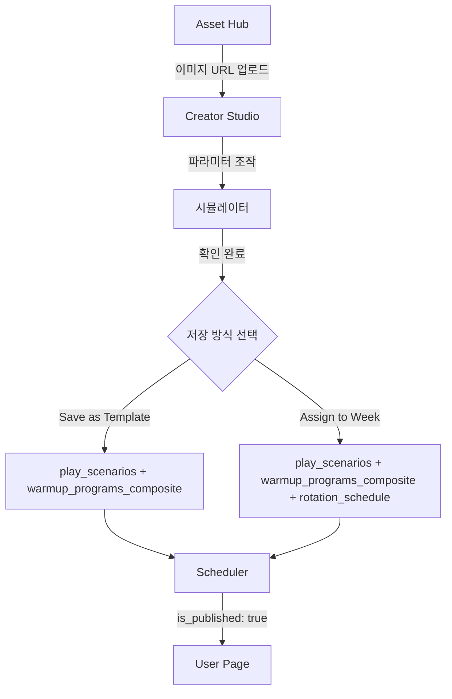

# 워크플로우 대수술: 3단계 직렬 구조 통합

## 목표

4개 탭을 3단계 직렬 구조로 통합하여 "만들고(Generator), 뿌린다(Scheduler)" 두 가지만 남기기. 하드코딩 제거 및 Single Source of Truth 확립.

## 현재 문제점

1. **Generator는 시뮬레이션만 제공**: DB 저장 기능 없음
2. **"프로그램 생성" 탭은 하드코딩**: 24개 액션을 하드코딩하여 생성. Generator 엔진 미사용
3. **두 시스템 분리**: Generator에서 만든 시나리오를 실제 프로그램으로 저장할 방법 없음
4. **복잡한 워크플로우**: 사용자가 여러 탭을 오가며 작업해야 함

## 새로운 3단계 직렬 구조

```
Step 1: Asset Hub (테마 관리)
  ↓
Step 2: Creator Studio (Generator + 프로그램 생성 통합)
  ↓
Step 3: Scheduler (주간 스케줄 배정)
```

### Step 1: Asset Hub
**파일**: `app/admin/iiwarmup/page.tsx` (tab: 'theme')

**역할**: 동작 이미지(0/1) 및 테마 에셋 업로드
- 주차별 테마 설정
- 각 동작(POINT, PULL, PUSH 등)의 OFF/ON 이미지 URL 관리
- `ThemeManager` 컴포넌트 사용

**변경사항**: 없음 (기존 유지)

### Step 2: Creator Studio
**파일**: `app/admin/iiwarmup/generator/page.tsx` (기존 Generator 확장)

**역할**: 파라미터 조작 → 시뮬레이션 → DB 즉시 저장
- 기존 Generator 기능 유지
- **추가**: DB 저장 기능
  - "Save as Template" 버튼: 템플릿으로만 저장
  - "Assign to Week" 버튼: 연도/월/주차 선택 후 즉시 배정 및 저장

**핵심 기능**:
1. 파라미터 조작 (Basic Settings Tab)
2. 실시간 시뮬레이션 (HybridSimulator)
3. DB 저장 (새로 추가)
   - `play_scenarios` 테이블에 시나리오 저장
   - `warmup_programs_composite` 테이블에 프로그램 생성
   - (선택) `rotation_schedule`에 배정

### Step 3: Scheduler
**파일**: `app/admin/iiwarmup/page.tsx` (tab: 'scheduler')

**역할**: 저장된 프로그램의 발행(Publish) 및 배포
- `rotation_schedule` 테이블 관리
- `is_published` 플래그로 발행/미발행 제어
- 템플릿을 특정 주차에 드래그 앤 드롭으로 배정

**변경사항**: 없음 (기존 유지)

## 데이터 흐름도



## 구현 계획

### Phase 1: 하드코딩 제거 및 DefaultTemplate 분리

**파일**: `app/lib/admin/logic/DefaultTemplate.ts` (신규)

**목적**: 하드코딩된 24개 액션을 기본 템플릿으로 분리

```typescript
export const DEFAULT_ACTIONS = [
  { type: 'POINT', startTime: 0, duration: 5, position: { x: 30, y: 40 }, intensity: 'MID' },
  { type: 'KNOCK', startTime: 5, duration: 5, position: { x: 50, y: 50 }, intensity: 'MID' },
  // ... 24개 액션
];

export function getDefaultScenario(): GeneratedScenario {
  return generateScenarioJSON({
    target: 'mixed',
    difficulty: 2,
    theme: 'kitchen',
    staticDurationRatio: 0.5
  });
}
```

**파일**: `app/admin/iiwarmup/page.tsx`

**변경사항**:
- `handleCreateProgram` 함수 수정: 하드코딩 대신 `getDefaultScenario()` 사용
- 또는 "프로그램 생성" 탭 전체 삭제 (Generator로 통합)

### Phase 2: Generator에 DB 저장 기능 추가

**파일**: `app/admin/iiwarmup/generator/components/BasicSettingsTab.tsx`

**추가 기능**:
1. 저장 섹션 추가 (하단)
2. "Save as Template" 버튼
3. "Assign to Week" 버튼 (클릭 시 연도/월/주차 드롭다운 표시)

**구현**:
```typescript
const handleSaveAsTemplate = async () => {
  // 1. play_scenarios에 저장
  const scenarioId = `template_${Date.now()}`;
  await supabase.from('play_scenarios').upsert({
    id: scenarioId,
    name: `${target} ${difficulty} ${theme} 템플릿`,
    theme: theme,
    duration: 120,
    scenario_json: scenario.play
  });
  
  // 2. warmup_programs_composite에 저장 (week_id: null)
  const programId = `program_${scenarioId}`;
  await supabase.from('warmup_programs_composite').upsert({
    id: programId,
    week_id: null, // 템플릿은 week_id 없음
    title: `${target} ${difficulty} ${theme} 프로그램`,
    phases: [
      { type: 'play', scenario_id: scenarioId, duration: 120 },
      { type: 'think', content_type: 'engine', duration: 120 },
      { type: 'flow', content_type: 'engine', duration: 300 }
    ]
  });
};

const handleAssignToWeek = async (year: number, month: number, week: number) => {
  const weekId = `${year}-${String(month).padStart(2, '0')}-W${week}`;
  
  // 1. play_scenarios에 저장
  const scenarioId = `week${week}_${theme}`;
  await supabase.from('play_scenarios').upsert({
    id: scenarioId,
    name: `${month}월 ${week}주차 ${theme} 테마`,
    theme: theme,
    duration: 120,
    scenario_json: scenario.play
  });
  
  // 2. warmup_programs_composite에 저장
  const programId = `program_${year}_${String(month).padStart(2, '0')}_w${week}`;
  await supabase.from('warmup_programs_composite').upsert({
    id: programId,
    week_id: weekId,
    title: `${month}월 ${week}주차 웜업 프로그램`,
    phases: [
      { type: 'play', scenario_id: scenarioId, duration: 120 },
      { type: 'think', content_type: 'engine', duration: 120 },
      { type: 'flow', content_type: 'engine', duration: 300 }
    ]
  });
  
  // 3. rotation_schedule에 배정
  await supabase.from('rotation_schedule').upsert({
    week_key: weekId,
    program_id: programId,
    is_published: false // 기본값은 미발행
  });
};
```

### Phase 3: Admin 페이지 구조 변경

**파일**: `app/admin/iiwarmup/page.tsx`

**변경사항**:
1. 탭 구조 변경: `'theme' | 'scheduler'` (2개만)
2. "프로그램 생성" 탭 삭제
3. Generator 링크를 "Creator Studio"로 명명 변경

**새로운 탭 구조**:
```typescript
const [tab, setTab] = useState<'theme' | 'scheduler'>('theme');
```

### Phase 4: Single Source of Truth 강제

**파일**: `app/lib/admin/logic/generateScenarioJSON.ts`

**변경사항**: 없음 (이미 Single Source of Truth)

**검증**: 모든 시나리오 생성은 `generateScenarioJSON()` 함수를 통해서만 수행되도록 강제

**파일**: `app/admin/iiwarmup/page.tsx` (handleCreateProgram)

**변경사항**: 하드코딩된 액션 대신 `getDefaultScenario()` 사용

```typescript
const handleCreateProgram = async (targetYear: number, targetMonth: number, targetWeek: number) => {
  // 하드코딩 제거, DefaultTemplate 사용
  const defaultScenario = getDefaultScenario();
  
  // 나머지 로직은 동일
};
```

## 구현 순서

1. **quickGenerator.ts 생성**: 빠른 자동 생성 로직
2. **DefaultTemplate.ts 생성**: 하드코딩된 24개 액션 분리 (선택적, 필요시)
3. **Generator에 저장 기능 추가**: BasicSettingsTab에 "✨ 빠른 자동 생성", "Save as Template", "Assign to Week" 버튼 추가
4. **Generator에 Saved Templates 섹션 추가**: 편집 중심 목록
5. **Admin 페이지 구조 변경**: "프로그램 생성" 탭 삭제, 탭을 2개로 축소
6. **Scheduler에 Program Library 사이드바 추가**: 배정 중심 목록 및 드래그 앤 드롭
7. **handleCreateProgram 수정 또는 삭제**: 하드코딩 제거, quickGenerate 사용
8. **검증**: 모든 시나리오가 generateScenarioJSON()을 통해서만 생성되는지 확인

## 최종 워크플로우

1. **Asset Hub**: 동작 이미지 URL 업로드
2. **Creator Studio**: 
   - 파라미터 설정 (Target, Difficulty, Theme)
   - 시뮬레이터에서 확인
   - "Assign to Week" 클릭 → 연도/월/주차 선택 → 즉시 저장 및 배정
3. **Scheduler**: 저장된 프로그램 확인 후 `is_published: true`로 발행

## Phase 5: 빠른 자동 생성 (Quick Magic) 기능

**파일**: `app/lib/admin/logic/quickGenerator.ts` (신규)

**목적**: 시스템 권장 밸런스에 맞춰 자동으로 시나리오 생성 (하드코딩된 24개 액션 절대 사용 금지)

**구현**:
```typescript
import { generateScenarioJSON } from './generateScenarioJSON';
import { generateEventTimeline } from './generateEventTimeline';
import { STATIC_DURATION_RATIOS } from '../constants/physics';
import { GeneratedScenario } from '../types/scenario';

export function quickGenerate(target: 'junior' | 'senior' | 'mixed'): GeneratedScenario {
  // 타겟별 가장 인기 있는 테마
  const popularThemes = {
    junior: 'kitchen',
    senior: 'space',
    mixed: 'kitchen'
  };
  
  // 표준 난이도
  const standardDifficulty = 2; // Medium
  
  const scenario = generateScenarioJSON({
    target,
    difficulty: standardDifficulty,
    theme: popularThemes[target],
    staticDurationRatio: STATIC_DURATION_RATIOS[target]
  });
  
  // Event Timeline 생성
  scenario.eventTimeline = generateEventTimeline(scenario);
  
  return scenario;
}
```

**파일**: `app/admin/iiwarmup/generator/components/ParameterPanel.tsx`

**추가 기능**: 상단에 "✨ 빠른 자동 생성" 버튼 추가
- 클릭 시 현재 타겟에 맞춰 자동 설정
- 0.5초 이내 시뮬레이터 자동 구동
- `quickGenerate()` 함수 호출하여 시나리오 생성

**UI 구현**:
```typescript
const handleQuickGenerate = () => {
  const quickScenario = quickGenerate(target);
  // 파라미터 자동 설정
  setDifficulty(2);
  setTheme(popularThemes[target]);
  setStaticDurationRatio(STATIC_DURATION_RATIOS[target]);
  // 시나리오 즉시 적용
  onScenarioChange(quickScenario);
  // 0.5초 이내 시뮬레이터 자동 구동 (이미 onScenarioChange로 처리됨)
};
```

## Phase 6: 저장된 프로그램 조회 기능

### 6.1 Generator 페이지: Saved Templates 섹션 (편집 중심)

**파일**: `app/admin/iiwarmup/generator/components/ParameterPanel.tsx`

**추가 기능**: 하단에 "Saved Templates" 섹션
- `play_scenarios` 테이블에서 최근 5~10개 조회
- 목록 클릭 시 해당 `scenario_json`을 Generator 상태에 주입
- 시뮬레이터 즉시 구동
- 편집 후 재저장 가능

**구현**:
```typescript
const [savedTemplates, setSavedTemplates] = useState<PlayScenario[]>([]);

useEffect(() => {
  loadSavedTemplates();
}, []);

const loadSavedTemplates = async () => {
  const { data } = await supabase
    .from('play_scenarios')
    .select('*')
    .order('created_at', { ascending: false })
    .limit(10);
  setSavedTemplates(data || []);
};

const loadTemplate = (template: PlayScenario) => {
  // scenario_json을 Generator 상태에 주입
  const loadedScenario: GeneratedScenario = {
    play: {
      content_type: 'engine',
      ...template.scenario_json
    },
    think: { content_type: 'engine' },
    flow: { content_type: 'engine' },
    eventTimeline: generateEventTimeline(loadedScenario)
  };
  onScenarioChange(loadedScenario);
};
```

### 6.2 Scheduler 페이지: Program Library 사이드바 (배정 중심)

**파일**: `app/admin/iiwarmup/page.tsx` (Scheduler 탭)

**추가 기능**: 좌측 또는 우측에 "Program Library" 사이드바
- `week_id`가 없거나 미발행된 프로그램 리스트업
- 드래그 앤 드롭으로 특정 주차에 배정
- `rotation_schedule` 업데이트
- 배정 상태 및 발행 상태 표시

**구현**:
```typescript
const [unassignedPrograms, setUnassignedPrograms] = useState<WarmupProgram[]>([]);

useEffect(() => {
  loadUnassignedPrograms();
}, []);

const loadUnassignedPrograms = async () => {
  // week_id가 null이거나 rotation_schedule에 없는 프로그램
  const { data: programs } = await supabase
    .from('warmup_programs_composite')
    .select('*')
    .or('week_id.is.null,week_id.eq.') // week_id가 null이거나 빈 문자열
    .eq('is_active', true);
  
  // rotation_schedule과 조인하여 발행 상태 확인
  const { data: schedules } = await supabase
    .from('rotation_schedule')
    .select('program_id, is_published');
  
  const scheduleMap = new Map(schedules?.map(s => [s.program_id, s.is_published]) || []);
  
  setUnassignedPrograms(programs?.map(p => ({
    ...p,
    is_published: scheduleMap.get(p.id) || false
  })) || []);
};

const handleDragAssign = async (programId: string, weekKey: string) => {
  await supabase.from('rotation_schedule').upsert({
    week_key: weekKey,
    program_id: programId,
    is_published: false // 기본값은 미발행
  });
};
```

## 최종 워크플로우 (3번 클릭 이내)

### 워크플로우 A: 빠른 생성 → 즉시 배정
1. **Generator 페이지**: "✨ 빠른 자동 생성" 클릭 → 시뮬레이터 자동 구동 (0.5초 이내)
2. **Generator 페이지**: "Assign to Week" 클릭 → 연도/월/주차 선택 → 즉시 저장 및 배정
3. **Scheduler 페이지**: 저장된 프로그램 확인 → `is_published: true`로 발행

### 워크플로우 B: 템플릿 저장 → 나중에 배정
1. **Generator 페이지**: "✨ 빠른 자동 생성" 클릭 → 시뮬레이터 자동 구동
2. **Generator 페이지**: "Save as Template" 클릭 → 템플릿 저장
3. **Scheduler 페이지**: Program Library에서 템플릿 드래그 → 주차에 배정 → 발행

### 워크플로우 C: 기존 템플릿 수정
1. **Generator 페이지**: "Saved Templates"에서 템플릿 클릭 → 시뮬레이터에 로드
2. **Generator 페이지**: 파라미터 수정 → "Assign to Week" 클릭
3. **Scheduler 페이지**: 발행 확인

## 핵심 원칙

1. **Single Source of Truth**: 모든 시나리오는 `generateScenarioJSON()` 또는 `quickGenerate()`를 통해서만 생성
2. **하드코딩 금지**: 24개 액션 하드코딩 절대 사용 금지
3. **3번 클릭 이내**: 빠른 자동 생성 → 확인 → 배정/저장
4. **편집/배정 분리**: Generator는 편집 중심, Scheduler는 배정 중심
