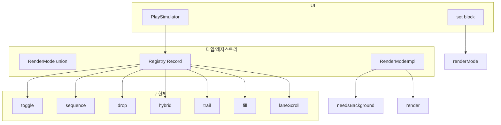

# 착시 몰입 RenderMode 확장 설계 (P0~P1)

## 배경

- 현재 [PlaySimulator.tsx](app/admin/iiwarmup/generator/components/PlaySimulator.tsx) set 블록: **on/off 토글만** 지원 (toggleMs 간격으로 off/on 이미지 교체).
- 상용화 감을 내려면 **"결과가 남는"** 렌더 모드가 최소 2~3개 이상 필요.

---

## 1. Core 4 + Core+3 (추천 세트)

### Core 4 (필수)

| 모드           | 설명                          | 결과가 남는가              |
| ------------ | --------------------------- | -------------------- |
| **toggle**   | on/off (기존)                 | 아님 — 현재 프레임만         |
| **sequence** | 1→2→… 누적 프레임                | 예 — 이전 프레임들이 계속 보임   |
| **drop**     | 0.5초마다 낙하/스폰                | 예 — 떨어진/스폰된 오브젝트가 쌓임 |
| **hybrid**   | 위 조합 (예: toggle + sequence) | 예                    |

### Core+ 3 (강추)

| 모드             | 설명                         | 결과가 남는가 |
| -------------- | -------------------------- | ------- |
| **trail**      | 스탬프가 좌표 따라 누적 (발자국 일반화)    | 예       |
| **fill**       | 당기기/채우기 (마스크 기반)           | 예       |
| **laneScroll** | 배경이 미세 이동 + 누적 ("수평선 전진감") | 예       |

### DoD

- **RenderMode가 "플러그인"처럼 추가 가능**: 새 타입 추가가 **파일 1개 수준** (또는 기존 레지스트리/맵에 1개 등록).

---

## 2. 설계: RenderMode 플러그인 구조

### 타입 정의 (단일 진입점)

**app/lib/admin/play/renderModes.ts** (신규 또는 기존 types 확장)

- `RenderMode` = `'toggle' | 'sequence' | 'drop' | 'hybrid' | 'trail' | 'fill' | 'laneScroll'`.
- **레지스트리**: `Record<RenderMode, RenderModeImpl>`.
- `RenderModeImpl` 인터페이스 예:
  - `id: RenderMode`
  - `needsBackground?: boolean` (권장 여부)
  - `render(ctx, canvas, state, assets, blockElapsedMs, block)` — 그리기 1프레임.
  - `getRequiredAssets?(block)` — 이 모드가 필요로 하는 에셋 키(off/on, sequence frames 등).

새 모드 추가 시: 위 레지스트리에 한 항목 추가 (또는 새 파일 1개에서 구현 후 레지스트리만 등록).

### PlaySimulator 연동

- set 블록에 **renderMode** (또는 기본값 `toggle`) 부여.
- 현재 "set 블록 = toggle만"인 부분을 **"현재 블록의 renderMode에 해당하는 Impl.render() 호출"**로 교체.
- 블록/타임라인 스키마에 `renderMode?: RenderMode` 필드 추가 시 기본값 `toggle` 유지.

### DoD 검증

- 새 RenderMode(예: `spawnBurst`) 추가 시, **새 타입 1개 + Impl 1개 등록**만으로 동작하도록 구성.

---

## 3. 에셋 구성: "배경이 필수냐?"

### 결론: 모드에 따라 다름

| 구분        | 모드                                   | 배경                       |
| --------- | ------------------------------------ | ------------------------ |
| **거의 필수** | laneScroll, swap                     | 있으면 체감 크게 상승 (현실 사진/공간감) |
| **없어도 됨** | trail, fill, spawnBurst, pivot/orbit | 오브젝트만 잘 있어도 몰입 (특히 프로젝터) |

### 설계 원칙

- **On/Off가 배경/물체가 되는 게 아님.**
- **RenderMode가 "무엇을 움직일지/어떻게 쌓일지"를 결정.**
- **배경은 "선택 옵션(있으면 좋음)"**으로 유지 — 모드별로 `needsBackground`로 권장만 표시.

### 데이터/에셋 구조

- [loadThemeAssets](app/lib/admin/assets/loadThemeAssets.ts) 등: `backgrounds.play` 는 이미 있음. 모드가 배경을 쓰면 사용, 없으면 미사용.
- 에셋 스키마/타입에서 "배경 필수"가 아니라 "모드별 권장" 메타만 두면 됨.

---

## 4. Action별 추천 매핑 (다음 단계 산출물)

- **다음 출력에서** 20개 Action 전체를 표로 매핑.
- 형식 예:
  - WALK → laneScroll + trail (배경 optional)
  - PULL → fill 또는 drop
  - TURN → pivot/orbit
  - STAMP → spawnBurst 또는 trail
  - …

이번 설계에서는 **"Action → RenderMode 추천 매핑"을 저장할 구조만 확보** (예: `app/lib/admin/play/actionRenderModeMap.ts` 또는 constants에 `ACTION_DEFAULT_RENDER_MODE: Partial<Record<ActionKey, RenderMode>>`). 실제 표 채우기는 별도 작업.

---

## 5. 구현 순서 권장

1. **타입 + 레지스트리**
  `RenderMode`, `RenderModeImpl`, 레지스트리 맵 정의. 기존 toggle 동작을 `toggle` Impl로 분리.
2. **PlaySimulator 리팩터**
  set 블록 렌더를 "레지스트리[block.renderMode ?? 'toggle'].render(…)" 호출로 교체.
3. **Core 4 구현**
  sequence, drop, hybrid (toggle+sequence 등) 각각 Impl 추가.
4. **Core+ 3 구현**
  trail, fill, laneScroll Impl 추가. laneScroll 시 배경 사용 로직 연동.
5. **에셋 권장 플래그**
  모드별 `needsBackground` 반영해 에디터/프리뷰에서 "배경 권장" 표시(선택).
6. **Action ↔ RenderMode 매핑**
  상수/맵 추가 후, 다음 단계에서 20개 Action 표로 채우기.

---

## 6. 의존성 요약

---

## 7. 요약

| 항목        | 내용                                      |
| --------- | --------------------------------------- |
| Core 4    | toggle, sequence, drop, hybrid          |
| Core+ 3   | trail, fill, laneScroll                 |
| 플러그인      | 새 모드 = 타입 1개 + Impl 1개 등록 수준            |
| 배경        | 모드별 선택 옵션(필수 아님), laneScroll/swap 등은 권장 |
| Action 매핑 | 구조만 확보, 20개 Action 표는 다음 단계 산출물         |

---

## 덩어리 3) 구현 순서 (커서 작업 플로우)

Play Studio 엔진 고도화(덩어리 1)와 RenderMode 확장(덩어리 2)을 하나의 작업 플로우로 묶은 순서.

| 순서  | 항목                                                      | 참고           |
| --- | ------------------------------------------------------- | ------------ |
| 1   | 블록 타입 통일 (kind / durationMs) — 재생 안 되는 문제 먼저 제거         | 덩어리 1 §3     |
| 2   | rules.ts 상수화                                            | 덩어리 1 §1     |
| 3   | themeId / assetPackId 일원화 + localStorage key 분리         | 덩어리 1 §2     |
| 4   | Responsive Canvas + fallback                            | 덩어리 1 §4     |
| 5   | useDraftEditor 도입 + reload 제거 + invalidate              | 덩어리 1 §5     |
| 6   | Energy Bar / Narrative                                  | 덩어리 1 §6     |
| 7   | RenderMode 프레임워크 도입 (toggle / sequence / drop / hybrid) | 덩어리 2 §1–2   |
| 8   | Core+ 3 (trail / fill / laneScroll) 추가                  | 덩어리 2 §1, §5 |

