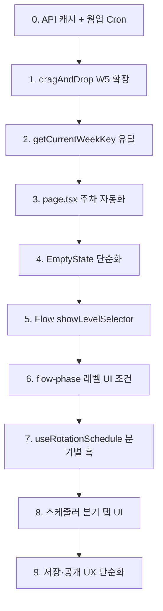

# iiwarmup 구독자 페이지 및 스케줄러 최종 개선 제안서

> 기반: [IIWARMUP_사용자페이지_UI_개선안.md](IIWARMUP_사용자페이지_UI_개선안.md), 사용자 요구사항 반영  
> **상용화 수준**: 1~5초 로딩은 수용 불가. API/인프라 개선 필수.

---

## 전제 조건

- **UI/UX 원칙**: 글자 겹침 없음, 모바일 반응형 필수. 모든 화면에서 텍스트 오버랩·잘림 검증 필요.
- **주차 형식**: 기존 스케줄러와 동일하게 **W1~W5** 사용. 월별 1~5주차.
- **로딩 목표**: 구독자 페이지 최초 진입 시 **2초 이내** 콘텐츠 표시. 콜드스타트 후 재방문 시 **1초 이내**.

---

## Part 0. API/인프라 — 로딩 속도 개선 (필수)

> 현재 1~5초+ 대기. 상용화를 위해 반드시 해결해야 하는 항목.

### 0.1 현황 (원인)

| 원인 | 영향 | 참고 |
|------|------|------|
| Vercel 서버리스 콜드스타트 | 첫 요청 시 1~5초 | [사용자페이지_로딩_왜_느린지.md](사용자페이지_로딩_왜_느린지.md) |
| Vercel ↔ Supabase DB 왕복 2단계 | 수백 ms ~ 1초 | think_asset_packs 2회 + rotation_schedule + warmup_programs 2회 |
| 캐시 미활용 | 재방문 시에도 매번 서버 호출 | 현재 s-maxage=60 적용, edge 캐시 미적용 |

### 0.2 개선 방안 (우선순위)

#### A. API 응답 캐시 강화 (즉시 적용 가능)

- **파일**: `app/api/schedule/[weekKey]/route.ts`
- **현재**: `Cache-Control: s-maxage=60, stale-while-revalidate=120`
- **변경**: `s-maxage=300`(5분), `stale-while-revalidate=600`(10분)
- **추가**: `next.config.ts`에서 `/api/schedule/*` 경로에 `headers` 캐시 설정, 또는 Route Segment Config `revalidate` 활용
- **효과**: 같은 weekKey 재방문 시 CDN/엣지에서 즉시 응답

#### B. DB 조회 통합 (1회 왕복으로 축소)

- **현재**: 1단계(3개 병렬) → 2단계(2개 병렬) = 2번 왕복
- **변경**: Supabase RPC 또는 단일 쿼리로 `rotation_schedule` + program + challenge + BGM/Think 메타를 **한 번에** 조회
- **구현**: DB 함수(POSTGRES) `get_schedule_for_week(week_key)` 생성 → API에서 1번 호출
- **효과**: 왕복 2회 → 1회, 수백 ms 절감

#### C. 콜드스타트 완화

| 방안 | 비용 | 효과 |
|------|------|------|
| **Vercel Cron 웜업** | 무료(제한 내) | 5~15분마다 `/api/schedule/{현재주차}` ping → 서버 유지 |
| **Vercel Pro / Enterprise** | 유료 | 함수 warm 유지 옵션 |
| **Edge Runtime 전환** | 코드 변경 | 서버리스보다 콜드스타트 짧음 (지역/플랜 의존) |

**권장**: Cron 웜업(cron 잡에서 현재 weekKey로 API 호출) + 캐시 강화 → 비용 없이 체감 개선

#### D. 이번 주 데이터 사전 로드 (선택)

- **구현**: `/iiwarmup` 페이지를 SSR 또는 `generateMetadata` 등에서 현재 weekKey로 API prefetch
- **또는**: `layout.tsx` 또는 페이지 진입 시 `prefetchQuery`로 React Query 캐시 선충전
- **효과**: HTML과 함께 데이터 준비, 클라이언트에서 대기 시간 단축

### 0.3 수정 대상

| 파일 | 변경 |
|------|------|
| `app/api/schedule/[weekKey]/route.ts` | Cache-Control 강화, (선택) DB RPC로 쿼리 통합 |
| `next.config.ts` | API 경로 캐시 헤더 (가능 시) |
| `vercel.json` 또는 Vercel Cron | 웜업용 크론 `GET /api/schedule/{currentWeekKey}` 등록 |
| (선택) `sql/` | `get_schedule_for_week(week_key)` RPC 함수 |

### 0.4 목표 수치

| 시나리오 | 현재 | 목표 |
|----------|------|------|
| 첫 방문 (콜드스타트) | 3~5초+ | 2초 이내 (웜업 + 캐시 시) |
| 재방문 (웜 서버) | 1~2초 | 1초 이내 |
| 같은 주차 재방문 | 1초+ | 0.5초 이내 (캐시 hit) |

---

## Part 1. 구독자 페이지 — 주차 자동화

### 1.1 목표

- WeekSelector 완전 제거 → 이번 주 프로그램만 자동 조회·표시
- Admin Scheduler에서 배정·공개한 프로그램 = 구독자에게 그대로 노출
- 사용자 페이지에서 "고르는" 동작 없음

### 1.2 주차 매핑 (W1~W5, 기존 스케줄러와 동일)

- **규칙**: 월 내 일자 기준
  - 1~7일 → W1
  - 8~14일 → W2
  - 15~21일 → W3
  - 22~28일 → W4
  - 29~31일 → W5

```ts
// app/lib/admin/scheduler/getCurrentWeekKey.ts (신규)

export function getCurrentWeekKey(): string {
  const now = new Date();
  const year = now.getFullYear();
  const month = now.getMonth() + 1;
  const day = now.getDate();
  const week = Math.min(5, Math.ceil(day / 7));
  return generateWeekKey(year, month, week);
}
```

### 1.3 로딩과의 관계

- **주차 선택 제거**: API 호출 횟수/구조는 동일. UX 단순화(고를 것 없음)로 체감 개선.
- **실제 속도 개선**: Part 0 (API/인프라) 적용 후 달성. 주차 자동화와 **함께** 진행해야 상용화 수준 로딩 확보.

### 1.4 수정 대상

| 파일 | 변경 |
|------|------|
| `app/lib/admin/scheduler/getCurrentWeekKey.ts` | 신규 생성 |
| `app/iiwarmup/page.tsx` | `FIXED_*` 제거, `getCurrentWeekKey()` 사용, WeekSelector·관련 state/핸들러 제거 |
| `app/components/subscriber/EmptyState.tsx` | "이전 주 보기" 제거, 단순 메시지로 변경 |

---

## Part 2. 구독자 페이지 — Flow 개별 실행 시 레벨 선택

### 2.1 목표

- Flow만 클릭 시 Admin과 동일하게 **좌측 상단**에 LV1~4 선택 UI 노출
- 전체 재생(Challenge→Think→Flow)의 Flow 구간에서는 레벨 선택 없음

### 2.2 수정 대상

| 파일 | 변경 |
|------|------|
| `app/components/subscriber/FlowFrame.tsx` | `showLevelSelector` prop 추가, iframe URL에 `showLevelSelector=1` 전달 |
| `app/components/subscriber/FullSequencePlayer.tsx` | `renderFlow`에 `showLevelSelector: mode === 'flow'` 전달 |
| `app/flow-phase/page.tsx` | `showLevelSelector` 파라미터로 레벨 UI 표시 조건 확장 |

---

## Part 3. 스케줄러 — W5 확장 및 분기별 로딩

### 3.1 W5 지원

| 파일 | 변경 |
|------|------|
| `app/lib/admin/scheduler/dragAndDrop.ts` | `parseWeekKey`: `W([1-4])` → `W([1-5])` |
| `app/lib/admin/scheduler/dragAndDrop.ts` | `generate48WeekSlots` → 주 5회 지원(1~5), 60슬롯(12×5) 또는 기존 48 유지하고 W5만 추가 |
| `parseWeekKey` 사용처 | W5 파싱 시 null 미반환되도록 확인 |

**옵션 A**: 48슬롯 유지, W5만 추가 → 60슬롯 (12개월×5주)
**권장**: 60슬롯. `generate48WeekSlots` **함수명 유지**, 내부만 week 1~5 순회로 변경 → 호출처 수정 없음.

### 3.2 분기별(Q1~Q4) 로딩

- **현재**: 12개월 아코디언, 열린 월만 로드
- **변경**: 분기 탭(Q1: 1~3월, Q2: 4~6월, Q3: 7~9월, Q4: 10~12월) → 해당 분기 3개월 데이터만 로드
- **효과**: 초기 로드 범위 축소, 분기별로 명확한 구조

| 파일 | 변경 |
|------|------|
| `app/admin/iiwarmup/scheduler/page.tsx` | 연도 + 분기 탭(Q1~Q4) 선택 UI |
| `app/lib/admin/hooks/useRotationSchedule.ts` | `useRotationScheduleQuarter(year, quarter)` 등 분기 단위 훅 추가 |

### 3.3 저장·공개 UX 단순화

- **현재**: 프로그램 선택 → 저장 버튼 → Published 체크박스 → 별도 동작. 복잡함.
- **변경**:
  - 프로그램 선택 = 해당 주차에 Challenge+Think+Flow 통합 프로그램 배정
  - **"배정 & 공개"** 한 버튼: 저장과 공개를 동시에 수행
  - 또는: 저장 → 자동 공개 옵션, "미공개로 저장" / "공개로 저장" 2버튼으로 명확히 분리
- **원칙**: 저장과 공개를 한 번에 처리할 수 있는 직관적 플로우

### 3.4 슬롯당 Challenge/Think/Flow 1개씩

- **현재**: `warmup_programs_composite` 1개 선택 = Challenge+Think+Flow 포함된 통합 프로그램
- **목표**: 각 주차 슬롯에 **챌린지 1개 + 띵크 1개 + 플로우 1개**가 확정되도록
- **구현**: 기존 `program_id`(복합 프로그램) 유지. 해당 프로그램이 phases에 Challenge/Think/Flow를 1개씩 포함하면 충족.
- **검증**: 프로그램 선택 시 "챌린지 O / 띵크 O / 플로우 O" 표시 또는, 미비 시 경고 메시지 노출

### 3.5 스케줄러 UI 구조 예시

```
[2025년 ▼] [Q1] [Q2] [Q3] [Q4]  ← 분기 탭

Q1 열림 시:
├ 1월
│  ├ 1주차 [프로그램 선택 ▼] [배정 & 공개]
│  ├ 2주차 [프로그램 선택 ▼] [배정 & 공개]
│  ├ ...
│  └ 5주차 [프로그램 선택 ▼] [배정 & 공개]
├ 2월 (동일)
└ 3월 (동일)
```

---

## Part 4. UI/UX 공통 원칙

### 4.1 텍스트·레이아웃

- **글자 겹침 금지**: 모든 텍스트가 다른 요소와 겹치지 않도록 여백·줄바꿈 확보
- **모바일 반응형**: `sm:`, `md:`, `lg:` 등 breakpoint 활용, 터치 영역 최소 44px
- **스크롤**: 가로 스크롤 시 `overflow-x-auto` + `scrollbar-thin` 등으로 가독성 유지

### 4.2 검증 포인트

| 화면 | 확인 항목 |
|------|-----------|
| 구독자 메인 | 헤더·메타 텍스트 겹침 여부, PhaseControls 그리드 모바일에서 1~2열 |
| EmptyState | 버튼·텍스트 겹침 없음 |
| Flow 레벨 선택 | 좌측 상단 패널, 모바일에서 잘리지 않는지 |
| 스케줄러 분기 | 분기 탭·월 아코디언, 모바일에서 터치·가독성 |
| SchedulerSlotCard | 드롭다운·버튼 영역, 작은 화면에서 겹침 없음 |

---

## 구현 순서



**0. API/인프라 (우선)** — 상용화를 위해 먼저 적용: API `Cache-Control` 강화, Vercel Cron 웜업, (선택) DB RPC 통합

1. `dragAndDrop.ts` — `parseWeekKey` W5, `generate48WeekSlots` 내부 60슬롯(week 1~5)
2. `getCurrentWeekKey.ts` 신규
3. `app/iiwarmup/page.tsx` — 고정 주차 제거, 자동 주차, WeekSelector 제거
4. `EmptyState` — 이전 주 보기 제거
5. FlowFrame + FullSequencePlayer — `showLevelSelector`
6. flow-phase — `showLevelSelector` 조건
7. `useRotationSchedule` — 분기별 쿼리
8. Scheduler 페이지 — 분기 탭 UI
9. SchedulerSlotCard — "배정 & 공개" 등 저장·공개 플로우 단순화

---

## Part 5. 최종 점검 — 기존 기능·Vercel 배포 영향

### 5.1 기존 정상 동작 영향 체크

| 변경 항목 | 영향 받는 기능 | 호환성 대응 |
|-----------|----------------|-------------|
| **parseWeekKey W5** | ThinkPhaseWrapper, PlayRuntimeWrapper, useRotationSchedule | W5 시 Think 이미지는 week2/3/4만 존재 → **week5는 week4로 fallback** 적용 필요. `ThinkPhaseWrapper` 53행: `weekFromKey`가 5일 때 `Math.min(4, week)` 등으로 4 사용 |
| **generate48→60슬롯** | useRotationSchedule, Scheduler 페이지 | `generate48WeekSlots` 내부만 수정(week 1~5 순회), **함수명 유지**하여 호출처 변경 최소화. 60슬롯 반환해도 rotation_schedule 스키마 변경 없음 |
| **WeekSelector 제거** | 구독자 page, Admin "구독자 미리보기" 링크 | Admin 미리보기 `/iiwarmup?week=1&audience=elementary`는 현재도 무시됨. 개선 후 `?weekKey=2025-02-W2` override 지원 시 미리보기 유연성 확보 (선택) |
| **EmptyState 단순화** | `hasPreviousWeek`, `onPreviousWeek`, `onFocusWeekSelector` | WeekSelector 제거 시 "이전 주 보기"·"주차 선택" 무의미. props 제거, 메시지만 표시. **기존 EmptyState 사용처(page.tsx 1곳)** 수정 |
| **FlowFrame showLevelSelector** | FullSequencePlayer `renderFlow` 시그니처 | 기존 `{ weekKey, onEnd }`에 `showLevelSelector` **추가**(선택 prop). 기존 호출부는 `showLevelSelector` 없으면 undefined → flow-phase에서 `admin \|\| showLevelSelector`로 처리하므로 **하위 호환** |
| **API Cache-Control** | 배포 환경 캐시 | 헤더만 변경. 응답 본문·스키마 동일. **stale 시 이전 데이터 노출** 가능 → s-maxage 300(5분) 수준이면 적정 |

### 5.2 Think 150 · W5 특수 처리 (필수)

- Think Asset Pack: **week2, week3, week4만** 존재. week5 이미지 없음.
- **조치**: `ThinkPhaseWrapper`에서 `weekFromKey === 5`일 때 `week = 4`로 사용 (week4 이미지 재사용)
- `think150ImagePath`, `thinkPackByMonthAndWeek` 구조 변경 없음

### 5.3 Vercel 배포 시 오류 방지

| 항목 | 점검 내용 |
|------|-----------|
| **vercel.json 신규** | Cron 추가 시 `vercel.json` 루트에 생성. `crons` 배열 형식 준수. 배포 시 Vercel이 자동 인식 |
| **Cron 경로** | `/api/schedule/[weekKey]`는 동적. **`/api/cron/warm-schedule`** 등 고정 경로 신규 생성 후, 내부에서 `getCurrentWeekKey()`로 현재 주차 조회 후 fetch 또는 직접 DB 호출 |
| **환경 변수** | `SUPABASE_SERVICE_ROLE_KEY`, `NEXT_PUBLIC_SUPABASE_*` 필수. [VERCEL_배포_검수.md](VERCEL_배포_검수.md) 참고 |
| **빌드** | `npm run build` 로컬 실행. `typescript: ignoreBuildErrors`, `eslint: ignoreDuringBuilds`로 빌드 중단 방지. 신규 파일의 import 경로·타입 오류 확인 |
| **getCurrentWeekKey import** | `generateWeekKey`는 `dragAndDrop.ts` 또는 `storagePaths.ts`에서 import. **순환 참조** 피하기 위해 `dragAndDrop` 권장 (scheduler 폴더 내 일관성) |
| **next.config** | API 캐시용 `headers` 추가 시 기존 `redirects`, `turbopack`, PWA 설정과 병합. 문법 오류 없이 적용 |

### 5.4 배포 전 체크리스트

- [ ] `parseWeekKey` W5 지원 후 `ThinkPhaseWrapper` week5 → week4 fallback
- [ ] `generate48WeekSlots` 60슬롯 변경 시 모든 사용처 동작 확인 (Scheduler 월별 5주차 표시)
- [ ] EmptyState props 변경 시 page.tsx에서 전달 인자 수정
- [ ] FlowFrame `showLevelSelector` optional prop, flow-phase 조건문 `admin \|\| showLevelSelector`
- [ ] `vercel.json` crons 경로·스케줄 문법 검증 (`*/5 * * * *` 등)
- [ ] 로컬 `npm run build` 성공
- [ ] 배포 후 구독자 페이지 `/iiwarmup` 접속 → 이번 주 프로그램 표시 확인
- [ ] Admin Scheduler W5 슬롯 표시·저장 확인

### 5.5 롤백 포인트

- 각 Part별로 단계 배포 권장. Part 0(캐시) → Part 1(주차 자동화) → ... 순으로 적용 시 문제 발생 구간 즉시 특정 가능.
- `generate48WeekSlots` 변경 시 기존 48슬롯 반환하도록 임시 분기 가능 (feature flag 등).

---

## 참고

- [사용자페이지_로딩_왜_느린지.md](사용자페이지_로딩_왜_느린지.md) — 로딩 지연 원인 분석
- [app/api/schedule/[weekKey]/route.ts](../app/api/schedule/[weekKey]/route.ts) — 구독자 스케줄 API
- [app/flow-phase/page.tsx](../app/flow-phase/page.tsx) — Admin 레벨 선택 UI (100~130행)
- [app/lib/admin/scheduler/dragAndDrop.ts](../app/lib/admin/scheduler/dragAndDrop.ts) — parseWeekKey, generate48WeekSlots
- [app/components/admin/scheduler/SchedulerSlotCard.tsx](../app/components/admin/scheduler/SchedulerSlotCard.tsx) — 현재 저장·Published 로직
