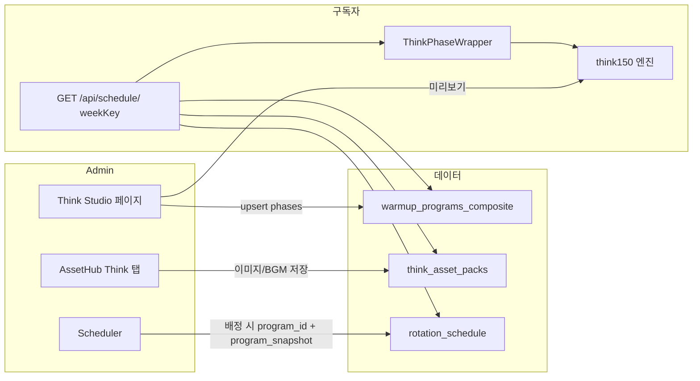

# Think 150 프로그램 동작 상세

현재 코드 기준으로 Think 단계가 어떻게 구성·저장·재생되는지 단계별로 정리한 문서입니다.

---

## 1. 전체 흐름 요약

- **Admin**: Think Studio에서 프로그램(주차별 config) 생성·수정, AssetHub에서 이미지/BGM 업로드, Scheduler에서 주차별로 Think 프로그램 배정·공개.
- **구독자**: `weekKey`로 API 호출 → `rotation_schedule` + `think_asset_packs` + 필요 시 `warmup_programs_composite` 조합 → ThinkPhaseWrapper가 think150 엔진으로 150초 재생.

---

## 2. 데이터 저장소

### 2.1 warmup_programs_composite (Think “프로그램” 정의)

| 컬럼 | Think 사용 방식 |
|------|------------------|
| id | `think150_week1` ~ `think150_week4` (고정 4개) |
| week_id | 항상 `'template'` (주차별 행이 아님, 템플릿 4개) |
| title | 예: "Think 150 - 1주차" |
| phases | `[{ type: 'think', content_type: 'think150', duration: 150, config }]` |
| config | `{ week: 1|2|3|4, audience, month? }` (월은 Upsert 시에만 넣음) |

- **역할**: 1~4주차별 “어떤 주차 규칙으로 150초를 재생할지” 정의. 실제 이미지 URL은 포함하지 않음.
- **생성·수정**: Think Studio “N주차 저장” → `useUpsertThink150Program` → 해당 `think150_weekN` 한 건 upsert (없으면 생성), config에 `week`, `audience`, `month`(선택) 포함.

### 2.2 think_asset_packs (Think 이미지·BGM)

두 종류의 row를 사용합니다.

| id | 용도 | assets_json 구조 |
|----|------|-------------------|
| `iiwarmup_think_default` | Think 150 월별×주차별 이미지 pack | `{ byMonth: { [1..12]: { week2, week3, week4 } } }` 각 항목은 `{ setA: { red, green, yellow, blue }, setB: { ... } }` **Storage 경로 문자열** |
| `iiwarmup_bgm_settings` | Think BGM 설정 (useThinkBGM) | `{ bgmList: string[], selectedBgm: string }` (Storage 경로) |

- 이미지 경로 형식: `themes/think150/iiwarmup_think_default/month{M}/week{W}/{setA|setB}/{color}/{slug}.webp`
- BGM 경로 형식: `audio/think/bgm/{fileName}`

### 2.3 rotation_schedule (주차별 “무엇을 보여줄지”)

| 컬럼 | Think 관련 |
|------|------------|
| week_key | 예: `2026-02-W3` |
| program_id | 배정된 프로그램 id (예: `think150_week3` 또는 챌린지면 `challenge_2026-02-W3`) |
| program_snapshot | Scheduler에서 배정 시 저장. Think 사용 시 `{ think150: true, week, month, audience }` (audience: '900ms' \| '700ms' \| '550ms') |
| is_published | true여야 구독자에게 노출 |

- **역할**: “이 주차(week_key)에는 어떤 프로그램을 보여주고, Think일 때 week/month/audience는 뭘로 할지”를 고정. Think 이미지 URL은 여기 없고 `think_asset_packs`에서만 가져옴.

---

## 3. Admin 쪽 동작

### 3.1 Think Studio 페이지 (`app/admin/iiwarmup/think/page.tsx`)

- **상태**
  - `audience`: '900ms' | '700ms' | '550ms' (cue/blank 타이밍)
  - `week`: 1 | 2 | 3 | 4 (어느 주차 규칙으로 타임라인 생성할지)
  - `previewMonth`: 1~12 (월별 pack 있을 때 어떤 월 이미지 쓸지)
  - `seed`: 타임라인 랜덤(색/순서) 시드
  - `debug`: 디버그 오버레이 on/off
  - URL 쿼리: `?month=&week=` 에서 초기값 읽고, 저장 성공 시 같은 쿼리로 갱신

- **데이터 소스**
  - `useThink150Pack()`: `think_asset_packs` id=`iiwarmup_think_default` 에서 `assets_json.byMonth` 로드 → `thinkPackByMonthAndWeek` (월→주차별 setA/setB URL) 생성.
  - `useThinkBGM()`: id=`iiwarmup_bgm_settings` 에서 `bgmList`/`selectedBgm` 로드.
  - pack 없으면 `MOCK_THINK_PACK` 사용 (엔진 타입 호환용 더미).

- **버튼**
  - “N주차 저장”: `useUpsertThink150Program().mutate({ week, audience, month: previewMonth })` → 해당 think150_weekN upsert(없으면 생성), config에 week/audience/month 넣음. 성공 시 URL에 month/week 반영.

- **미리보기**
  - `Think150Player`에 넘기는 config: audience, week, month: previewMonth, seed, thinkPackByMonthAndWeek 또는 thinkPack(MOCK), bgmPath.
  - `Think150Player` 내부에서 `buildThink150Timeline(config)` 호출 → 150초 구간의 이벤트 배열 생성 후 requestAnimationFrame으로 재생, BGM/효과음 스케줄링.

### 3.2 Think 150 엔진 (미리보기·구독자 공통)

- **입력**: `Think150Config` (audience, week, month?, seed, thinkPack | thinkPackByWeek | thinkPackByMonthAndWeek, bgmPath?).
- **출력**: `ThinkTimelineEvent[]` (t0, t1, phase, frame, payload).

**고정 150초 구간 (think150Scheduler.ts SEGMENTS)**

| 구간 | phase | ms 범위 |
|------|--------|---------|
| 0 | intro | 0–6_000 |
| 1 | ready | 6_000–10_000 |
| 2 | stageA | 10_000–34_000 |
| 3 | rest1 | 34_000–40_000 |
| 4 | stageB | 40_000–70_000 |
| 5 | rest2 | 70_000–76_000 |
| 6 | stageC | 76_000–136_000 |
| 7 | rest3 | 136_000–142_000 |
| 8 | outro | 142_000–150_000 |

- **audience**: `thinkTiming.ts`의 `AUDIENCE_CUE_BLANK_MS`로 cue/blank 길이 결정 (3종: 900ms / 700ms / 550ms).
- **week**
  - 1주: 색상만(이미지 없음), stageC는 vertical/horizontal 레이아웃.
  - 2·3·4주: thinkPack에서 setA/setB 이미지 사용 가능. stageC slotCount/레이아웃/메모리 규칙이 주차별로 다름 (weekRulesEngine + think150Scheduler 내 분기).
- **pack 선택**: `getPackForWeek(week, thinkPack, thinkPackByWeek, month, thinkPackByMonthAndWeek)` → 1주는 undefined, 2·3·4주는 month 있으면 thinkPackByMonthAndWeek[month].weekN, 없으면 thinkPackByWeek.weekN 또는 thinkPack.

### 3.3 AssetHub Think 탭 (`ThinkAssetPanel`)

- **useThink150Pack**: 위와 동일하게 `iiwarmup_think_default` 로드. `upload(month, week, set, color, file)` 시 WebP 최적화 후 Storage에 올리고, 해당 month/week/set/color 경로를 `assets_json.byMonth`에 반영해 다시 upsert.
- **useThinkBGM**: `iiwarmup_bgm_settings` 로드/저장. BGM 파일 업로드 시 `thinkBgmPath(fileName)` 경로로 Storage에 저장하고, `bgmList`/`selectedBgm` 갱신.
- UI: 선택된 월에 대해 3주차 이미지(4색)·4주차 이미지(4색) 각각 업로드/삭제 (setA만 사용, 주차 선택 탭 없음).

### 3.4 Scheduler에서 Think 배정

- 사용자가 특정 week_key(예: 2026-02-W3)에 “Think 150 - 3주차” 같은 프로그램을 선택 후 “배정 & 공개” 클릭.
- `SchedulerSlotCard.savePayload`에서 `program_snapshot: { think150: true, week, month, audience }` 로 전달. (week/month/audience는 슬롯에서 선택한 값.)
- `useSaveSchedule` mutation이 rotation_schedule에 week_key, program_id(예: think150_week3), program_snapshot, is_published 등을 upsert.
- 따라서 “어느 주차에 어떤 Think 주차 규칙을 보여줄지”는 Scheduler에서 배정할 때 snapshot으로 고정됨.

---

## 4. 구독자 쪽 동작

### 4.1 스케줄 API `GET /api/schedule/[weekKey]`

- **조회**
  - rotation_schedule: week_key로 1건 (program_id, program_snapshot, is_published).
  - think_asset_packs: id=`iiwarmup_think_default` 1건 → assets_json.byMonth → 월별 week2/week3/week4 setA/setB 경로를 **공개 URL**로 바꿔 `thinkPackByMonthAndWeek` 형태로 반환.
  - (챌린지용) warmup_programs_composite 등 추가 조회.
- **응답**
  - program_snapshot, is_published, phases, challengePhases, challengeBgmPath 등
  - **thinkPackByMonthAndWeek**: 1~12월 각각 { week2, week3, week4 } 형태로 setA/setB 색상별 **풀 URL** (storagePathToPublicUrl).

### 4.2 구독자 페이지 (`app/iiwarmup/page.tsx`)

- `getCurrentWeekKey()`로 이번 주 weekKey 계산.
- `useSubscriberSchedule(weekKey)` → 위 API 호출.
- `thinkSnapshot = scheduleData?.program_snapshot?.think150 ? scheduleData.program_snapshot : undefined` 로 “이번 주에 Think가 배정되었는지 + snapshot” 판단.
- 재생 시 `FullSequencePlayer`에 `renderThink`로 `ThinkPhaseWrapper` 전달. props: weekKey, onEnd, scheduleSnapshot(thinkSnapshot), thinkPackByMonthAndWeek(scheduleData.thinkPackByMonthAndWeek), month(undefined 등).

### 4.3 ThinkPhaseWrapper (`app/components/subscriber/ThinkPhaseWrapper.tsx`)

- **week 결정**: scheduleSnapshot?.week ?? weekKey 파싱값. (5주는 4로 폴백.)
- **audience**: scheduleSnapshot?.audience ?? 'elementary'.
- **month**: scheduleSnapshot?.month ?? monthProp ?? weekKey 파싱 month.
- **config**: audience, week, month(있으면), seed(한 번만 생성), thinkPackByMonthAndWeek 또는 없으면 MOCK_THINK_PACK, bgmPath(useThinkBGM에서 selected).
- **타임라인**: `buildThink150Timeline(config)` 로 한 번 생성.
- **재생**: playing=true로 mount 시 바로 시작. requestAnimationFrame으로 currentMs 진행, 150초 도달 시 onEnd() 호출. BGM/효과음은 think150Audio에서 스케줄링.

즉, 구독자 Think 단계는 “이번 주 rotation_schedule의 program_snapshot(think150, week, month, audience) + API에서 내려준 thinkPackByMonthAndWeek”만 쓰고, warmup_programs_composite의 phases는 재생 로직에서 직접 쓰지 않음. (배정된 program_id가 think150_weekN이면, 그 주차 규칙은 snapshot의 week로 이미 고정된 상태.)

---

## 5. 파일별 역할 (Think 한정)

| 파일/경로 | 역할 |
|-----------|------|
| app/admin/iiwarmup/think/page.tsx | Think Studio UI, audience/week/month/seed 선택, 주차 저장, Think150Player 미리보기 |
| app/lib/admin/hooks/useThink150Pack.ts | think_asset_packs iiwarmup_think_default CRUD, pathsByMonthAndWeek ↔ thinkPackByMonthAndWeek 변환, upload/remove |
| app/lib/admin/hooks/useThinkBGM.ts | think_asset_packs iiwarmup_bgm_settings 로드/저장, BGM 목록·선택·업로드·삭제 |
| app/lib/admin/hooks/useUpsertThink150Program.ts | think150_weekN 1건 upsert, config에 week/audience/month |
| app/lib/admin/engines/think150/think150Scheduler.ts | SEGMENTS 기준으로 이벤트 생성, intro/ready/rest/outro/stageA/B/C 주차별 분기, buildThink150Timeline 진입점 |
| app/lib/admin/engines/think150/weekRulesEngine.ts | Stage C용 cue 스펙(색 개수/메모리 등) 계산 |
| app/lib/admin/engines/think150/think150AssetLoader.ts | getPackForWeek, getImageUrl, preloadThinkPack(ByWeek/ByMonth) |
| app/lib/admin/engines/think150/think150Audio.ts | BGM/효과음 스케줄링, init/suspend/resume |
| app/lib/admin/constants/thinkTiming.ts | Audience별 cue/blank ms |
| app/components/admin/think150/Think150Player.tsx | Admin 미리보기: 타임라인 빌드·검증·재생, Think150Viewer/ProgressBar/DebugOverlay |
| app/components/admin/think150/Think150Viewer.tsx | 현재 이벤트에 따라 intro/ready/stageA/B/C/rest/outro UI 렌더 |
| app/components/subscriber/ThinkPhaseWrapper.tsx | 구독자 Think 전체화면: config 조합, 타임라인 빌드, 재생 루프, onEnd 시 다음 단계로 |
| app/api/schedule/[weekKey]/route.ts | rotation_schedule + think_asset_packs(이미지 pack) + 챌린지 등 조회, thinkPackByMonthAndWeek URL 변환 후 반환 |
| app/components/admin/scheduler/SchedulerSlotCard.tsx | 배정 시 program_snapshot에 think150: true, week, month, audience 고정 저장 |

---

## 6. 주의할 점 (수술 시 참고)

- **Think 프로그램 4개는 week_id='template'**: 주차별 복사본이 아니라 id=think150_week1~4 템플릿 4개만 있음. “이 주차에 3주차 규칙 쓰기”는 Scheduler가 program_id=think150_week3 + program_snapshot.week=3 으로 고정하는 구조.
- **program_snapshot.audience**: SchedulerSlotCard에서 900ms/700ms/550ms 중 선택해 저장.
- **구독자 Think의 month**: scheduleSnapshot.month ?? weekKey의 month. 배정 시 snapshot에 month가 들어가므로, Scheduler에서 저장하는 snapshot에 month가 포함됨(현재 savePayload의 month).
- **이미지가 없을 때**: 1주는 항상 색상만. 2·3·4주에서 pack이 없거나 URL이 비어 있으면 getImageUrl이 '' 반환 → 엔진은 그대로 cue/blank 이벤트 생성하고, Viewer 쪽에서 빈 이미지 처리.
- **BGM**: Think BGM은 useThinkBGM의 selectedBgm(think_asset_packs iiwarmup_bgm_settings). 챌린지 BGM과 id가 다름(iiwarmup_challenge_bgm_settings). API는 Think 이미지 pack만 변환해서 내려주고, Think BGM은 클라이언트 useThinkBGM으로 로드하는 구조가 아니라 구독자 ThinkPhaseWrapper에서 useThinkBGM을 쓰므로, 구독자도 “현재 로그인/설정”이 아니라 공용 설정 하나를 쓸 수 있게 하려면 API에서 Think BGM 경로를 내려주거나, think_asset_packs에 BGM 설정을 두고 API에서 함께 내려줄 필요 있음. (현재는 ThinkPhaseWrapper가 useThinkBGM 호출 → 같은 테이블 row를 읽음.)

이 문서는 현재 동작을 세세히 파악해 두었으므로, Think 프로그램 수술 시 “어디를 바꿔야 어떤 동작이 바뀌는지” 참고용으로 사용할 수 있습니다.

---

## 7. 한계 및 개선 포인트 (최적화·디벨롭)

### 7.1 데이터·스키마

- **program_snapshot.audience 고정**: Scheduler에서 Think 배정 시 `audience: 'elementary'` 하드코딩. 주차별/캠페인별로 다른 연령대를 쓰려면 snapshot 스키마 확장 + 스케줄러 UI에서 audience 선택 필요.
- **Think 프로그램 4개 템플릿만 존재**: 주차별로 "다른 규칙 세트"를 쓰려면 현재는 week 1~4 고정. 주차 수·규칙 세트를 늘리려면 warmup_programs_composite 쪽 id/week_id 정책 또는 "Think 프로그램 버전" 개념 도입 검토.
- **이미지 pack 단일 row**: `iiwarmup_think_default` 한 row에 12개월×3주차×2셋×4색 = 많은 경로가 들어감. 월/주차만 필요한데 전체 byMonth를 항상 로드·전달. "이번 주에 필요한 월 pack만" 조회/캐시하면 페이로드·메모리 절감 가능.
- **BGM 설정과 이미지 pack 분리**: Think BGM은 `iiwarmup_bgm_settings`, 이미지는 `iiwarmup_think_default`. 구독자 API에서 Think BGM 경로를 함께 내려주지 않아, 구독자도 useThinkBGM으로 같은 row를 읽는 구조. API 한 번에 "이번 주 Think에 필요한 모든 것(이미지 pack + BGM 경로)"을 내려주면 클라이언트 요청 수·일관성 개선.

### 7.2 성능·최적화

- **타임라인 매 프레임 검색**: `findCurrentEvent(events, currentMs)`가 매 tick마다 events 배열을 순회. 이벤트가 수백 개일 수 있으므로, "현재 구간 인덱스"를 유지하고 다음 이벤트로 넘어갈 때만 인덱스++ 하는 방식으로 O(1)화 가능.
- **useThink150Pack 전체 12개월 로드**: Admin AssetHub/Think Studio 진입 시 항상 전체 byMonth 로드. "선택된 월만" 또는 "최근 사용 월 + 선택 월"만 가져오고 나머지는 lazy load 하면 초기 로딩·메모리 감소.
- **thinkPackByMonthAndWeek 전달 크기**: API 응답에서 12개월 전체 URL 객체를 내려줌. 구독자는 해당 weekKey의 month만 쓰면 되므로, API에서 "해당 주차가 속한 월의 pack만" 반환하거나, 클라이언트에서 "현재 month만 보관"하도록 정리하면 네트워크·파싱 비용 감소.
- **preload 시점**: ThinkPhaseWrapper/Think150Player에서 config가 바뀔 때마다 preloadThinkPackByMonth 등 호출. 이미 로드된 월/주차는 캐시해서 중복 preload 방지 가능.
- **think150Audio 전역 싱글톤**: AudioContext·버퍼·gain 노드가 모듈 레벨에 있음. 여러 Think 인스턴스(예: 탭 여러 개)가 동시에 있으면 충돌 가능. 인스턴스별로 감싸거나, "한 번에 하나만 재생"을 보장하는 플레이어 레벨 락이 있으면 안전.

### 7.3 코드 구조·유지보수

- **재생 로직 중복**: Think150Player(Admin)와 ThinkPhaseWrapper(구독자)가 타임라인 빌드 → requestAnimationFrame 루프 → BGM/사운드 스케줄링을 거의 동일하게 구현. 공통 훅(예: useThink150Playback(timeline, config))으로 묶으면 수정·버그 수정 시 한 곳만 보면 됨.
- **SEGMENTS·문구 하드코딩**: think150Scheduler.ts에 150초 구간·rest 문구·outro 문구가 상수로만 존재. 운영에서 문구/구간 변경 시 코드 수정 필요. 설정 테이블이나 JSON으로 빼두면 비개발자도 조정 가능.
- **주차별 분기 다수**: stageA/stageB/stageC, getStageCLayout, getRestLabel 등이 week 1~4 if/switch로 흩어져 있음. "주차별 규칙 정의"를 한 곳(예: weekRules + segmentRules)으로 모으면 새 주차 추가·규칙 변경이 쉬움.
- **타입·페이로드 일관성**: ThinkTimelineEvent.payload가 phase별로 다른 타입. TypeScript는 유니온으로 되어 있으나, 런타임에서 phase와 payload.type 이중 체크가 반복됨. phase→payload 매핑을 타입/헬퍼로 고정하면 가독성·안정성 향상.

### 7.4 UX·기능

- **구독자 Think BGM 출처 불명확**: BGM이 "공용 설정"인지 "이번 주 전용"인지 UI에 없음. API에서 Think BGM을 내려주고, "이번 주 BGM"으로 표시하면 일관성 개선.
- **미리보기와 실제 재생 시드 불일치**: Admin에서는 seed를 바꿔가며 미리보기 가능하지만, 구독자는 Date.now()로 한 번만 생성. "같은 주차를 같은 시드로 다시 보기"가 없음. (필요 시) 시드를 URL이나 설정으로 넘기면 재현·테스트에 유리.
- **에러·로딩 상태**: pack 로드 실패·BGM 로드 실패 시 사용자에게 알리는 UI가 약함. 빈 이미지/무음만 나올 수 있음. 로딩/에러 상태를 Viewer 상단에 표시하고, 재시도 버튼을 두면 디벨롭에 도움.
- **접근성**: ready 카운트다운·rest 문구 등이 스크린리더/키보드만으로는 불리할 수 있음. aria-live·포커스 관리·대체 텍스트 정리하면 접근성 개선.

### 7.5 확장·디벨롭

- **새 주차(예: 5주차) 추가**: SEGMENTS는 그대로 두고 week 5 분기를 여러 파일에 추가해야 함. "주차 규칙"을 데이터 드리븐으로 만들면(week → rule set id → 규칙 파라미터) 코드 수정 없이 주차 추가 가능.
- **다국어/문구 버전**: rest/outro/intro 문구가 한국어 고정. 키 기반(예: rest1_week2)으로 조회하고 locale별 문자열 테이블을 두면 다국어 대응 가능.
- **A/B 테스트·캠페인**: "이번 주만 다른 intro 문구/이미지 세트"를 넣으려면 현재는 snapshot이나 pack 구조 확장이 필요. "캠페인 id" 또는 "variant"를 snapshot에 넣고, API/엔진에서 variant별 asset 선택 로직을 두면 디벨롭에 유리.
- **분석·로그**: 구독자가 Think 단계에서 어느 구간에서 이탈하는지, 재생 완료율 등이 수집되면 콘텐츠 개선에 활용 가능. phase 전환 시 로그 이벤트를 한 곳에서 보내도록 하면 확장 시 유지보수하기 좋음.

**우선순위 요약**: 즉시 손볼 만한 것 → audience 스냅샷 확장·스케줄러 연동, findCurrentEvent O(1)화, 재생 로직 공통 훅, API에서 Think BGM + 필요 월 pack만 반환. 중기 → 주차/규칙 데이터 드리븐화, 문구·구간 설정 외부화, 에러/로딩 UX, 접근성. 장기 → 다국어, A/B·캠페인, 분석 로그.

---

## 8. 기술·운영 진단 v2 반영 — 수정 가능성 및 비회귀 검증

보고서 v2의 결론(배포 진실·에셋 변형 가능 구조가 리스크)과 P0 개선안을 기준으로, **내부 기능/동작을 깨지 않고** 수정·개선이 가능한지 코드 경로별로 검증한 결과.

### P0-1: snapshot 확장 + Scheduler UI 연동

| 항목 | 현재 | 변경 | 비회귀 여부 |
|------|------|------|-------------|
| audience | SchedulerSlotCard에서 `audience: 'elementary'` 하드코딩 | program_snapshot에 실제 선택값 저장, Scheduler UI에 audience 선택 추가 | **유지 가능**. ThinkPhaseWrapper는 이미 `scheduleSnapshot?.audience ?? 'elementary'` 사용 → API에서 audience 내려주면 그대로 반영. 기존 배정 row는 snapshot에 audience 없을 수 있음 → 폴백 'elementary'로 동작 유지. |
| seed_policy / variant / pack_version | 없음 | snapshot 스키마에 선택 추가 (추후 확장용) | **추가만** 하면 기존 클라이언트는 무시. 엔진이 읽는 쪽만 나중에 구현하면 됨. |

**터치 포인트**: `SchedulerSlotCard.savePayload`(snapshot 객체 구성), Scheduler 슬롯 UI(드롭다운 또는 별도 audience 선택), `useSubscriberSchedule` 타입(program_snapshot 필드 확장).  
**결론**: 기존 동작 유지하면서 확장 가능. 하위 호환 유지.

---

### P0-2: API에서 "이번 주 Think 완결 패키지"

| 항목 | 현재 | 변경 | 비회귀 여부 |
|------|------|------|-------------|
| Think BGM | API 미포함. 구독자는 useThinkBGM()으로 동일 row 재조회 | API 응답에 Think BGM path 포함 (think_asset_packs iiwarmup_bgm_settings에서 읽어서) | **유지 가능**. ThinkPhaseWrapper에서 `thinkResolvedConfig.bgmPath ?? useThinkBGM().selected` 처럼 API 우선·hook 폴백으로 가면 기존 동작 유지. |
| Pack 범위 | 12개월 전체 thinkPackByMonthAndWeek 반환 | 이번 주 month에 해당하는 pack만 반환 (thinkPackForThisWeek 또는 thinkResolvedConfig 내 pack) | **추가 후 전환 가능**. 1단계: API에 `thinkResolvedConfig`·`thinkPackForThisWeek` **추가**하고 기존 `thinkPackByMonthAndWeek` 유지. 2단계: ThinkPhaseWrapper가 새 필드 있으면 그걸 쓰고, 없으면 기존 필드+month로 동작. 3단계: 클라이언트 전환 완료 후 API에서 12개월 전체 제거 검토. |
| resolvedConfig | 없음. 클라이언트가 snapshot+pack+BGM 조합 | API에서 week/month/audience/seedPolicy/bgmPath 등 확정값으로 내려줌 | **추가만**. 구독자는 "API에 thinkResolvedConfig 있으면 그대로 config로 쓰고, 없으면 기존처럼 조합"으로 하면 회귀 없음. |

**터치 포인트**: `app/api/schedule/[weekKey]/route.ts`(think pack 조회 시 row.program_snapshot의 month로 해당 월만 추출, BGM 설정 row 조회 추가), 응답 타입·SubscriberScheduleData, ThinkPhaseWrapper의 config 생성 로직(API 우선).  
**결론**: 추가 필드 + 구독자 쪽 "새 필드 우선, 없으면 기존 로직"으로 하면 내부 기능/동작 유지하며 적용 가능.

---

### P0-3: findCurrentEvent O(1)화

| 항목 | 현재 | 변경 | 비회귀 여부 |
|------|------|------|-------------|
| 이벤트 검색 | 매 tick마다 `events.find(e => ms >= e.t0 && ms < e.t1)` (O(n)) | 현재 인덱스 ref 유지, currentMs가 다음 이벤트 t0 이상이면 인덱스++ 후 해당 이벤트 반환 | **동작 동일**. 같은 currentMs에 대해 같은 event가 나오면 됨. 입출력만 맞추면 됨. |

**터치 포인트**: Think150Player·ThinkPhaseWrapper 내부의 findCurrentEvent 호출부. 공통 유틸로 빼거나 훅 내부에서 인덱스 추적.  
**결론**: 순수 내부 최적화. 기능/동작 변경 없음.

---

### P0-4: 재생 로직 공통 훅(모듈화)

| 항목 | 현재 | 변경 | 비회귀 여부 |
|------|------|------|-------------|
| 재생 루프 | Think150Player와 ThinkPhaseWrapper가 각각 timeline 빌드 → RAF → 사운드 스케줄 → currentMs 업데이트 | useThink150Playback(timeline, config) 또는 Think150Runtime로 통합, Admin/Subscriber는 UI만 다르게 얹음 | **동작 유지**. 두 컴포넌트가 "같은 재생 시맨틱"을 공유하는 것이 목적이므로, 추출 후에도 재생 결과(진행·사운드·종료 시점)가 동일하면 됨. |

**터치 포인트**: Think150Player.tsx, ThinkPhaseWrapper.tsx. 공통 훅에서 (timeline, config, onEnd?) → { currentMs, event, playing, reset/start } 반환. Viewer·ProgressBar·버튼은 기존처럼 각 페이지에 두고 event/currentMs만 훅에서 받음.  
**결론**: 리팩터만으로 동작 동일 유지 가능.

---

### 의도적 동작 변경이 필요한 부분 (운영 정책 반영)

| 항목 | 현재 | 보고서 권고 | 비고 |
|------|------|-------------|------|
| Pack 없을 때 구독자 | thinkPackByMonthAndWeek 없으면 MOCK_THINK_PACK 사용 → "가짜" 재생 | 운영(Prod)에서는 Mock 금지. pack 없으면 로딩/에러 표시 | **의도적 변경**. ThinkPhaseWrapper에서 `thinkPackByMonthAndWeek`·`thinkPackForThisWeek` 둘 다 없을 때 MOCK 대신 "준비 중" 또는 에러 UI로 넘기면 됨. 개발/스테이징에서는 query나 env로 mock 허용 유지 가능. |

이 부분만 "재생은 되는데 빈 이미지/무음"에서 "재생 전에 실패 표시"로 바뀌는 것이므로, **기능 요구사항으로 명시**하고 배포 시 점검하면 됨.

---

### 종합: 내부 기능·동작 관점 정리

- **P0-1 (snapshot 확장)**: 기존 필드 유지 + 필드 추가. audience 등 새 값이 있으면 사용, 없으면 기존 폴백. **회귀 없이 적용 가능.**
- **P0-2 (API 완결 패키지)**: 응답에 새 필드 추가, 구독자는 "새 필드 우선·없으면 기존 로직". **회귀 없이 적용 가능.** (이후 12개월 전체 제거는 클라이언트 전환 후 선택.)
- **P0-3 (findCurrentEvent O(1))**: 내부 구현만 변경. **동작 동일.**
- **P0-4 (재생 공통 훅)**: 추출·공유만. **동작 동일.**
- **Mock 금지(Prod)**: pack 없을 때 동작만 "mock 재생" → "로딩/에러"로 바꾸는 **의도적 변경**. 나머지 재생 로직에는 영향 없음.

따라서 보고서 v2의 P0 개선안은 **현재 내부 기능과 동작을 깨지 않는 범위에서** 수정·개선 가능하며, 유일한 의도적 변경은 "구독자 Prod에서 pack 없을 때 Mock 대신 에러/로딩" 처리이다.
